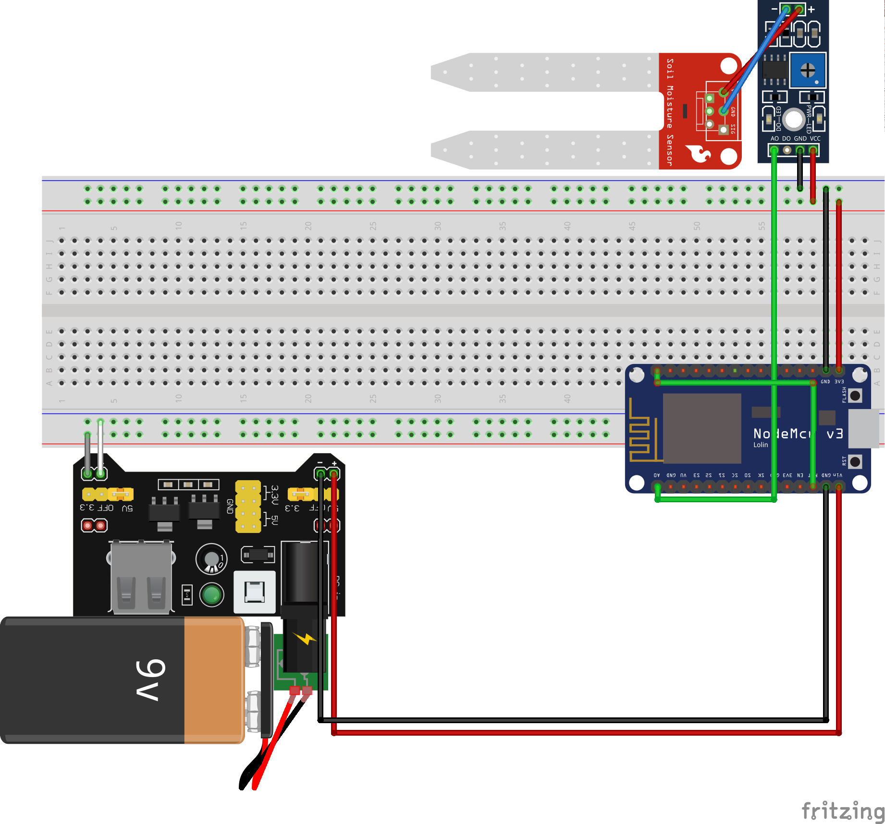

# Irrigatore automatico con interfaccia web
1. **Sensore** :  Prende l'umidità del terreno, se il terreno non è bagnato va al punto 2 altrimenti va al punto 3
2. **Attuatore** : Attiva la pompa dell'acqua e torna al punto 1
3. **Wifi** : invia i dati al server e va a dormire per 1 ora

### Componenti
* Versione low price
  * **Board** : ESP8266 (NodeMCU 1.0)
  * **AD Board** : Flying fish MH Sensor
  * **Sensore** : Soil Mosture Sensor
  * **Utility** : Jumper wire
  * **Attuatore** : Relay JQC3F (HW-482)
  * **Attuatore** : Pompa dell'acqua JT80SL
  * **Power supply** : Elegoo power MB V2

## 1. Sensore umidità
* Alimentiamo L'esp8266 attraverso una batteria (output 9v) collegata all'Elegoo power MB v2 (output 5v x2)
* Alimentiamo il Flying fish MH Sensor e il Soil Mosture Sensor attraverso nodeMCU v3 (output 3.3v)
* Inseriamo il pin output digital 0 dentro il pin input reset (per abilitare il DeepSleep)
#### Schema fritzing
- Black = -
- Red   = + 
- Green = Control

#### Codice
**leafScreen.ino**

    const int humidityInputPin = A0;
    int humidityValue = 0;
    int waitTime = 3600;
    
    void setup() {
        pinMode(humidityInputPin, INPUT);
        Serial.begin(9600);
    }

    void loop() {
        humidityValue = analogRead(analogInPin);
        ESP.deepSleep(waitTime * 1000000);
    }

## 2. Attuatore pompa

 *  Inseriamo un Relay JQC3F (HW-482) alimentato dal 3.3v di ESP8266 e controllato dall'output digital pin 1.
 * Alimentiamo la pompa con un altra path del Power MB V2 facendo passare la corrente attraverso il relay

#### Schema fritzing
- Black = - (1)
- Gray  = - (2)
- Red   = + (1)
- White = + (2)
- Green = Control

#### Codice
**leafScreen.ino**

    const int humidityInputPin = A0;
    const int releeController = D1;
    int humidityValue = 0;
    int state = 0;

    void setup() {
        pinMode(humidityInputPin, INPUT);
        pinMode(releeController, OUTPUT);
        Serial.begin(9600);
        state++;
    }

    void loop() {
        switch(state){
            
            case 1:
                int tempHumidity[6];
                for (int i = 0; i<5;i++){
                    tempHumidity[i] = analogRead(humidityInputPin);
                    humidityValue += tempHumidity[i]; 
                    delay(200);
                }
                humidityValue /= 5;
                if(humidityValue < 800){
                    state = 3;
                }else{
                    state = 2;
                }
                break;

            case 2:
                digitalWrite(releeController,HIGH);
                state = 1;
                break;

            case 3:
                digitalWrite(releeController,LOW);
                ESP.deepSleep(waitTime * 1000000);
                break;
        }
    }

## Parte 3 : Integrazione Wifi
#### Codice
**leafScreen.ino**

    #include <ESP8266WiFi.h>
    #include <ESP8266HTTPClient.h>

    #define HOST "www.website.com"
    #define WIFI_SSID "SSID"                                      
    #define WIFI_PASSWORD "PASS"    

    const int humidityInputPin = A0;
    const int releeController = D1;
    const int wetSoil = 800;
    const int waitTime = 3600;

    int state = 0;
    int humidityValue = 0;
    int safeCounter = 0;
    boolean sendData = true;
    String sendval, postData;

    void setup() {
        // Set the board I/O
        pinMode(humidityInputPin, INPUT);
        pinMode(releeController, OUTPUT);
        Serial.begin(9600);
        delay(2000);
        
        // Connect to WiFi
        WiFi.mode(WIFI_STA);           
        WiFi.begin(WIFI_SSID, WIFI_PASSWORD);
        while (WiFi.status() != WL_CONNECTED) 
        { 
            delay(500); 
        }
    }

    void loop() {
            switch(state){
            case 0:
                // Init variables
                humidityValue = 0;

                // Get humidity value
                humidityValue = getHumidity();

                // Start HTTP session and send data
                if(!sendData){
                    HTTPClient http;
                    http.begin(HOST);
                    http.addHeader("Content-Type", "application/x-www-form-urlencoded");
                    sendval = String(humidityValue);
                    postData = "sendval=" + sendval;
                    int httpCode = http.POST(postData);

                    // Check for connection error
                    if (httpCode != 200) {
                        http.end(); 
                        return;
                    }
                }

                // Check is moist is wet
                safeCounter++;
                if(humidityValue < wetSoil || safeCounter > 20){
                    state = 2;
                }else{
                    state = 1;
                }
                break;

            case 1:
                digitalWrite(releeController,HIGH);
                sendData = false;
                state = 0;
                break;

            case 2:
                digitalWrite(releeController,LOW);
                ESP.deepSleep(waitTime * 1000000);
                break;
        }
        delay(200);
    }

    int getHumidity(){
        int tempHumidityValue = 0;
        int tempHumidity[6];
        for (int i = 0; i<5;i++){
            tempHumidity[i] = analogRead(humidityInputPin);
            tempHumidityValue += tempHumidity[i]; 
            delay(200);
        }
        tempHumidityValue /=5;
        return tempHumidityValue;
    }

**dbRead.php**
    
    <?php
    // Set DB variables
    $host = "localhost";
    $dbname = "dbName";   
    $username = "dbUsername";
    $password = "dbPassword";

    // Establish connection to MySQL database
    $conn = new mysqli($host, $username, $password, $dbname);

    // Check if connection established successfully
    if ($conn->connect_error)
        die("Connection failed: " . $conn->connect_error);

    // Select values from MySQL database table
    $sql = "SELECT id, value, date, time FROM table";
    $result = $conn->query($sql);

    // Print the value on the website
    echo "
";
    if ($result->num_rows > 0) {
        while($row = $result->fetch_assoc()) {
            echo "<strong> Id:</strong> " . $row["id"]. " &nbsp <strong>value:</strong> " . $row["value"]. " &nbsp <strong>Date:</strong> " . $row["date"]." &nbsp <strong>Time:</strong>" .$row["time"]. "
";
        }
    } else {
        echo "0 results";
    }
    echo "
";

    // Close the connection
    $conn->close();

    ?>

**dbWrite.php**

    <?php

    // Set DB variables
    $host = "localhost";
    $dbname = "dbName";   
    $username = "dbUsername";
    $password = "dbPassword";

    // Establish connection to MySQL database
    $conn = new mysqli($host, $username, $password, $dbname);

    // Check if connection established successfully
    if ($conn->connect_error)
        die("Connection failed: " . $conn->connect_error);

    // Get date and time variables
    date_default_timezone_set('Europe/Amsterdam');
    $d = date("Y-m-d");
    $t = date("H:i:s");
        
    // Insert value into SQL db
    if(!empty($_POST['sendval']) )
    {
        $val = $_POST['sendval'];
        $sql = "INSERT INTO table (value, date, time) VALUES ('".$val."', '".$d."', '".$t."')"; 
    }

    // Close the connection
    $conn->close();

    ?>
