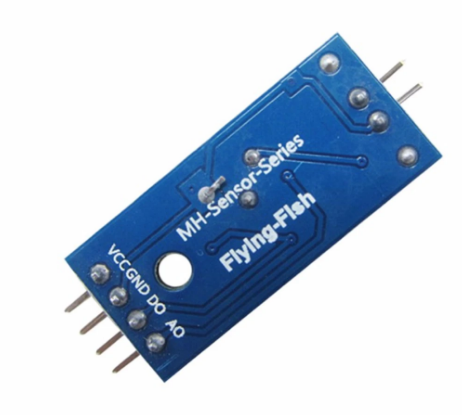
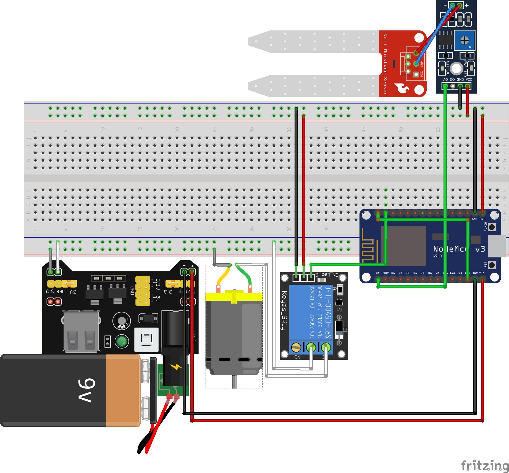

### Spiegazione
>Il progetto è un irrigatore automatico per piante con monitoraggio su sito internet , l'attuatore (la pompa dell'acqua) agisce in base al sensore (sensore umidità).
Il microcontroller controlla l'umidità del terreno ogni X ore , come dato usa una media di Y misurazioni fatte nel giro di poco tempo , manda il dato a un database e controlla se è necessario far partire la pompa dell'acqua , nel caso in cui non è necessario si mette a dormire e torna a fare la richiesta dopo X ore , invece nel caso in cui sia necessario continua a controllare l'umidità del terreno a intervalli di pochi secondi mentre la pompa è in funzione , quando l'umidità raggiunge la giusta soglia si mette a dormire fino alla prossima richiesta.

### Componenti
> * Flying fish MH Sensor
> * Soil Mosture Sensor
> * Jumper wire
> * Relay JQC3F (HW-482)
> * Pompa dell'acqua JT80SL

### Installazione

>* installare l'ultima versione di arduino IDE dal sito ufficiale di arduinoESP
>* dall'IDE di arduino aprire "preferences"
>* aggiungere "https://arduino.esp8266.com/stable/package_esp8266com_index.json" nell' "Additional Board Manager URL"
>* aprire "Tools" > "Board" > "Board Manager" e installare "ESP8266 community"
>* aprire "Tools" > "Board" > "ESP8266 boards" e selezionare "NodeMCU 1.0"
>* Collegare ESP8266 al computer

## Parte 1 : Prendere l'umidità
#### Componenti
>* Flying fish MH Sensor

>* Soil Mosture Sensor

>* Jumper wire

#### Schema fritzing
>

#### Codice
**leafScreen.ino**

    const int humidityInputPin = A0;
    int humidityValue = 0;
    
    void setup() {
        pinMode(humidityInputPin, INPUT);
        Serial.begin(9600);
    }

    void loop() {
        humidityValue = analogRead(analogInPin);
        delay(500);
    }

#### Note
> In questa parte settiamo il pin analogico 0 dell ESP8266 come input, inizializziamo la comunicazione seriale e prendiamo il dato ogni 0.5 secondi , questo modo di prendere il dato è molto grezzo e puo portare a problemi dati da oscillazioni.
> Inoltre colleghiamo il pin digitale 0 al reset per resettare l'ESP durante il deepsleep , useremo questa funzione piu avanti.

## Parte 2 : Innaffiare il terreno
#### Componenti
* Relay JQC3F (HW-482)

* Pompa dell'acqua JT80SL

#### Codice
**leafScreen.ino**

    const int humidityInputPin = A0;
    const int releeController = D1;
    int humidityValue = 0;

    void setup() {
        pinMode(humidityInputPin, INPUT);
        pinMode(releeController, OUTPUT);
        Serial.begin(9600);
    }

    void loop() {    
        humidityValue = analogRead(humidityInputPin);
        if(humidityValue < 800){
                    digitalWrite(releeController,LOW);
                }else{
                    digitalWrite(releeController,HIGH);
                    while(humidityValue > wetSoil - 50){
                        humidityValue = analogRead(humidityInputPin);
                        delay(1000);
                    }
                    // Turn the pump off because the soil is wet enough
                    digitalWrite(releeController,LOW);
                }
        delay(10000);
    }

#### Schema fritzing

#### Note
>In questa parte del progetto usiamo il relay per azionare la pompa dell'acqua , attaccato al controllo del relay abbiamo il pin digitale D1 che da un segnale basso se il terreno è gia umido (ovvero humidityValue è minore di 800) e da un segnale alto se il terreno è asciutto (ovvero humidityValue è maggiore di 800), in questo caso entra in un loop fino a quando il terreno è abbastanza umido (ovvero il valore è sopra 850) , dopodiche spegne la pompa e aspetta 10 secondi prima di ricominciare.

## Parte 3 : Wifi , SQL , DeepSleep e refactoring.
#### Codice
**leafScreen.ino**

    #include <ESP8266WiFi.h>
    #include <ESP8266HTTPClient.h>

    #define HOST "www.website.com"
    #define WIFI_SSID "SSID"                                      
    #define WIFI_PASSWORD "PASS"    

    const int humidityInputPin = A0;
    const int releeController = D1;
    const int wetSoil = 800;
    const int waitTime = 3600;

    int humidityValue = 0;
    String sendval, postData;

    void setup() {
        // Set the board I/O
        pinMode(humidityInputPin, INPUT);
        pinMode(releeController, OUTPUT);
        Serial.begin(9600);
        delay(2000);
        
        // Connect to WiFi
        WiFi.mode(WIFI_STA);           
        WiFi.begin(WIFI_SSID, WIFI_PASSWORD);
        while (WiFi.status() != WL_CONNECTED) 
        { 
            delay(500); 
        }
    }

    void loop() {
        //Init variables
        HTTPClient http;
        humidityValue = 0;
        int tempHumidity[6];
  
        // Prepare data
        for (int i = 0; i<5;i++){
            tempHumidity[i] = analogRead(humidityInputPin);
            Serial.print("[1] Collected value : ");
            Serial.println(tempHumidity[i]);
            humidityValue += tempHumidity[i]; 
            delay(400);
        }
        
        humidityValue /= 5;
        Serial.print("[2] Final value = ");
        Serial.println(humidityValue);
        sendval = String(humidityValue);
        postData = "sendval=" + sendval;

        // Start HTTP session and send data
        http.begin(HOST);
        http.addHeader("Content-Type", "application/x-www-form-urlencoded");
        int httpCode = http.POST(postData);

        // Check for connection error
        if (httpCode != 200) {
            http.end(); 
            return; 
        }

        if(humidityValue < wetSoil){
            // Turn off the pump is soil is wet
            digitalWrite(releeController,LOW);
        }else{
            // Turn on the pump if soil is not wet
            digitalWrite(releeController,HIGH);
            while(humidityValue > wetSoil - 50){
                // Keep the pump on while soil isnt wet enough
                humidityValue = analogRead(humidityInputPin);
                delay(1000);
            }
            // Turn the pump off because the soil is wet enough
            digitalWrite(releeController,LOW);
            Serial.println("[4] Pump off");
        }
        
        //Go deepsleep for 1 hour(thank to D0 connected to RST)
        ESP.deepSleep(waitTime * 1000000);
    }

**dbRead.php**
    
    <?php

    // Set DB variables
    $host = "localhost";
    $dbname = "dbName";   
    $username = "dbUsername";
    $password = "dbPassword";

    // Establish connection to MySQL database
    $conn = new mysqli($host, $username, $password, $dbname);

    // Check if connection established successfully
    if ($conn->connect_error)
        die("Connection failed: " . $conn->connect_error);

    // Select values from MySQL database table
    $sql = "SELECT id, value, date, time FROM table";
    $result = $conn->query($sql);

    // Print the value on the website
    echo "
";
    if ($result->num_rows > 0) {
        while($row = $result->fetch_assoc()) {
            echo "<strong> Id:</strong> " . $row["id"]. " &nbsp <strong>value:</strong> " . $row["value"]. " &nbsp <strong>Date:</strong> " . $row["date"]." &nbsp <strong>Time:</strong>" .$row["time"]. "
";
        }
    } else {
        echo "0 results";
    }
    echo "
";

    // Close the connection
    $conn->close();

    ?>

**dbWrite.php**

    <?php

    // Set DB variables
    $host = "localhost";
    $dbname = "dbName";   
    $username = "dbUsername";
    $password = "dbPassword";

    // Establish connection to MySQL database
    $conn = new mysqli($host, $username, $password, $dbname);

    // Check if connection established successfully
    if ($conn->connect_error)
        die("Connection failed: " . $conn->connect_error);

    // Get date and time variables
    date_default_timezone_set('Europe/Amsterdam');
    $d = date("Y-m-d");
    $t = date("H:i:s");
        
    // Insert value into SQL db
    if(!empty($_POST['sendval']) )
    {
        $val = $_POST['sendval'];
        $sql = "INSERT INTO table (value, date, time) VALUES ('".$val."', '".$d."', '".$t."')"; 
    }

    // Close the connection
    $conn->close();

    ?>

#### Note
> In questa parte del progetto aggiungiamo le funzionalità di rete , il microcontroller si connette al wifi e manda il dato attraverso un http request , questa viene poi controllata da un server e inserita dentro un database SQL.
> Usiamo deepsleep al posto di delay alla fine , in questa maniera conserviamo batteria spegnendo quasi completamente l'ESP8266 e aspettando un ora prima di riaccenderlo.
> Al posto di prendere 1 singolo valore di umidità prendiamo 5 valori e facciamo la media , questo per evitare possibili oscillazioni.